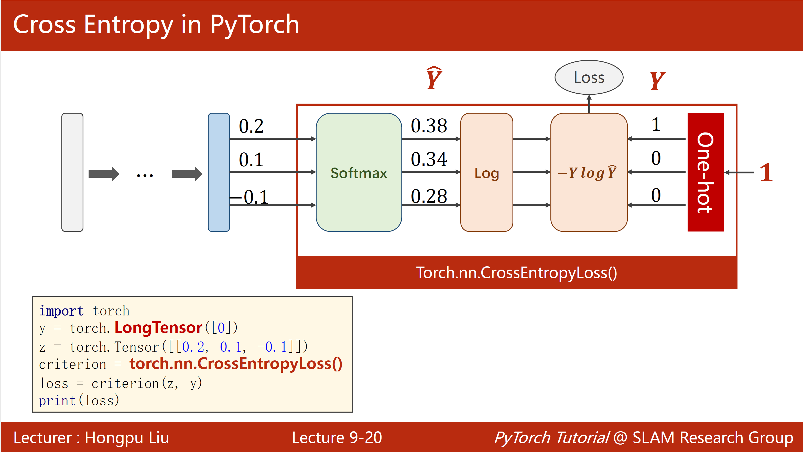

# 从 Bigram 语言模型到自注意力整个流程介绍

## Bigram 语言模型

Bigram 语言模型，就是一种非常基础的语言模型，它假设：下一个词（或字符）只取决于前一个词（或字符）。

现在有一段话，为`ilove`，假如对应的编码分别为：

`{'e': 1, 'i': 2, 'l': 3, 'o': 4, 'v': 5}`

那么编码后，这段话为：

`ilove`->`2, 3, 4, 5, 1`

若特殊符号 `{'.' : 0}` 表示词的开始/结束，固定为 0

设置 时间序列（上下文）T 长度为 5， 那么对于 Bigram 语言模型，我们希望学到的是:

`x = 2, 3, 4, 5, 1`
->
`y = 3, 4, 5, 1, .`

即:

| 输入 | 输出 | Bigram 实际看的部分 | 含义 |
|---|---|---|---|
| `2` | `3` | `2 -> 3` | `i -> l` |
| `3` | `4` | `3 -> 4` | `l -> o` |
| `4` | `5` | `4 -> 5` | `o -> v` |
| `5` | `1` | `5 -> 1` | `v -> e` |
| `1` | `0` | `1 -> 0` | `e -> .` |

这里就可以转换成的交叉熵问题来进行训练。 

---

## 引入嵌入层和批次
如果不用嵌入层，可以把 token 先变成 one-hot，再乘一个权重矩阵得到 logits；这在数学上可行，但实现上会显式构造稀疏高维向量，计算与内存效率较差。

在本项目的 Bigram 实现中使用 `nn.Embedding(vocab_size, vocab_size)`，本质是“查表”：

- 输入 token id，直接取出对应的一行 logits。
- 这与 `one-hot @ W` 在数学上等价，但更高效。
- 这里嵌入维度等于 `vocab_size`，主要目的不是降维，而是高效参数化 bigram 转移。

此外，为了利用并行计算，训练会按批次组织数据。若批大小为 `B`、上下文长度为 `T`，则输入索引张量形状是 `(B, T)`，Bigram 输出 logits 形状是 `(B, T, vocab_size)`。

---

## 考虑下一个词（或字符）取决于之前时刻所有词（或字符）

在 Bigram 语言模型中，下一个词（或字符）只取决于前一个词（或字符）。这有一个显著的问题，当前的词（或字符）可能取决于之前所有的词（或字符），只是重要性不同。

所以我们可以想方法将输入进行聚合，比如： t 时刻的 token 与之前所有时刻 token 的信息做聚合。这里用"均值"来实现。

具体的实现方法有三个版本, 下面用一个具体的 $4\times 3$ 输入矩阵，说明这三个版本为什么会得到同样的结果:

---

#### 1. 输入矩阵

设只有一个 batch，输入矩阵为

$$
x=
\begin{bmatrix}
1 & 2 & 3\\
4 & 5 & 6\\
7 & 8 & 9\\
10 & 11 & 12
\end{bmatrix}
$$

其中：

- $T=4$，表示共有 4 个时刻
- $C=3$，表示每个 token 的特征维度是 3

记每一行分别为

$$
x_1=[1,2,3],\quad
x_2=[4,5,6],\quad
x_3=[7,8,9],\quad
x_4=[10,11,12]
$$

我们的目标是构造输出矩阵 $x_{\text{bow}}$，满足：

$$
x_{\text{bow}}[t]=\frac{1}{t}\sum_{i=1}^{t}x_i
$$

也就是说，第 $t$ 个位置的输出，是前 $t$ 个 token 向量的逐维平均。

---

#### 2. 版本 1：直接循环求均值

版本 1 的思路最直接：对每个时刻 $t$，取出从第 1 个到第 $t$ 个 token，然后求均值。

##### 第 1 行输出

$$
x_{\text{bow}}[1]=x_1=[1,2,3]
$$

##### 第 2 行输出

$$
x_{\text{bow}}[2]=\frac{x_1+x_2}{2}
=
\frac{1}{2}
\begin{bmatrix}
1+4,\;2+5,\;3+6
\end{bmatrix}
=
\begin{bmatrix}
2.5,\;3.5,\;4.5
\end{bmatrix}
$$

##### 第 3 行输出

$$
x_{\text{bow}}[3]=\frac{x_1+x_2+x_3}{3}
=
\frac{1}{3}
\begin{bmatrix}
1+4+7,\;2+5+8,\;3+6+9
\end{bmatrix}
=
\begin{bmatrix}
4,\;5,\;6
\end{bmatrix}
$$

##### 第 4 行输出

$$
x_{\text{bow}}[4]=\frac{x_1+x_2+x_3+x_4}{4}
=
\frac{1}{4}
\begin{bmatrix}
1+4+7+10,\;2+5+8+11,\;3+6+9+12
\end{bmatrix}
=
\begin{bmatrix}
5.5,\;6.5,\;7.5
\end{bmatrix}
$$

所以最终结果是：

$$
x_{\text{bow}}=
\begin{bmatrix}
1 & 2 & 3\\
2.5 & 3.5 & 4.5\\
4 & 5 & 6\\
5.5 & 6.5 & 7.5
\end{bmatrix}
$$

---

#### 3. 版本 2：用下三角矩阵做加权平均

这一版先构造下三角矩阵：

$$
L=\operatorname{tril}(\mathbf{1})=
\begin{bmatrix}
1 & 0 & 0 & 0\\
1 & 1 & 0 & 0\\
1 & 1 & 1 & 0\\
1 & 1 & 1 & 1
\end{bmatrix}
$$

然后对每一行做归一化，即每一行除以该行的元素和：

$$
\mathrm{wei}=
\begin{bmatrix}
1 & 0 & 0 & 0\\
\frac12 & \frac12 & 0 & 0\\
\frac13 & \frac13 & \frac13 & 0\\
\frac14 & \frac14 & \frac14 & \frac14
\end{bmatrix}
$$

于是

$$
x_{\text{bow2}}=\mathrm{wei}\, x
$$

即

$$
x_{\text{bow2}}=
\begin{bmatrix}
1 & 0 & 0 & 0\\
\frac12 & \frac12 & 0 & 0\\
\frac13 & \frac13 & \frac13 & 0\\
\frac14 & \frac14 & \frac14 & \frac14
\end{bmatrix}
\begin{bmatrix}
1 & 2 & 3\\
4 & 5 & 6\\
7 & 8 & 9\\
10 & 11 & 12
\end{bmatrix}
$$

逐行计算如下。

##### 第 1 行

$$
[1,0,0,0]x=x_1=[1,2,3]
$$

##### 第 2 行

$$
\left[\frac12,\frac12,0,0\right]x
=
\frac12x_1+\frac12x_2
=
[2.5,3.5,4.5]
$$

##### 第 3 行

$$
\left[\frac13,\frac13,\frac13,0\right]x
=
\frac13x_1+\frac13x_2+\frac13x_3
=
[4,5,6]
$$

##### 第 4 行

$$
\left[\frac14,\frac14,\frac14,\frac14\right]x
=
\frac14x_1+\frac14x_2+\frac14x_3+\frac14x_4
=
[5.5,6.5,7.5]
$$

因此：

$$
x_{\text{bow2}}=
\begin{bmatrix}
1 & 2 & 3\\
2.5 & 3.5 & 4.5\\
4 & 5 & 6\\
5.5 & 6.5 & 7.5
\end{bmatrix}
$$

这与版本 1 完全一致。

---

#### 4. 版本 3：使用 Masked Softmax

这一版先构造一个全零矩阵：

$$
A=
\begin{bmatrix}
0 & 0 & 0 & 0\\
0 & 0 & 0 & 0\\
0 & 0 & 0 & 0\\
0 & 0 & 0 & 0
\end{bmatrix}
$$

然后把未来位置屏蔽掉，即把上三角部分设为 $-\infty$：

$$
A_{\text{masked}}=
\begin{bmatrix}
0 & -\infty & -\infty & -\infty\\
0 & 0 & -\infty & -\infty\\
0 & 0 & 0 & -\infty\\
0 & 0 & 0 & 0
\end{bmatrix}
$$

接下来对每一行做 softmax：

$$
\mathrm{wei}=\operatorname{softmax}(A_{\text{masked}})
$$

由于可见位置上的值全都是 $0$，而

$$
e^0=1
$$

不可见位置上是 $-\infty$，而

$$
e^{-\infty}=0
$$

所以 softmax 后，每一行会在“可见位置”上平均分配权重。

##### 第 1 行

$$
\operatorname{softmax}([0,-\infty,-\infty,-\infty])
=
[1,0,0,0]
$$

##### 第 2 行

$$
\operatorname{softmax}([0,0,-\infty,-\infty])
=
\left[\frac12,\frac12,0,0\right]
$$

##### 第 3 行

$$
\operatorname{softmax}([0,0,0,-\infty])
=
\left[\frac13,\frac13,\frac13,0\right]
$$

##### 第 4 行

$$
\operatorname{softmax}([0,0,0,0])
=
\left[\frac14,\frac14,\frac14,\frac14\right]
$$

因此 softmax 得到的权重矩阵就是：

$$
\mathrm{wei}=
\begin{bmatrix}
1 & 0 & 0 & 0\\
\frac12 & \frac12 & 0 & 0\\
\frac13 & \frac13 & \frac13 & 0\\
\frac14 & \frac14 & \frac14 & \frac14
\end{bmatrix}
$$

于是

$$
x_{\text{bow3}}=\mathrm{wei}\,x
$$

从而：

$$
x_{\text{bow3}}=
\begin{bmatrix}
1 & 2 & 3\\
2.5 & 3.5 & 4.5\\
4 & 5 & 6\\
5.5 & 6.5 & 7.5
\end{bmatrix}
$$

这与版本 1、版本 2 完全一致。

---

#### 5. 三个版本的本质

##### 版本 1

直接按定义求前缀平均：

$$
x_{\text{bow}}[t]=\frac{1}{t}\sum_{i=1}^{t}x_i
$$

##### 版本 2

手工构造一个下三角平均矩阵：

$$
x_{\text{bow2}}=\mathrm{wei}\,x
$$

##### 版本 3

先做因果 mask，再做 softmax：

$$
x_{\text{bow3}}=\operatorname{softmax}(A_{\text{masked}})\,x
$$

由于这里所有可见位置的分数相同，因此 softmax 后变成均匀分布，也就等价于“求均值”。

## 引入自注意力

### 1. 先从“简单平均”说起

在前面的版本中，我们做的其实都是一件事：

> 对当前位置之前的所有 token 做加权求和。

例如第 3 个版本可以写成：

$$
\text{out}_t=\sum_{i \le t}\alpha_{t,i}x_i
$$

其中权重 $\alpha_{t,i}$ 是：

$$
\alpha_{t,i}=
\begin{cases}
\frac{1}{t}, & i \le t \\
0, & i > t
\end{cases}
$$

这表示当前位置只能看自己和过去的位置，并且对所有历史位置都**一视同仁**。

也就是说，它做的是：

- 能看历史
- 不能看未来
- 但是所有历史 token 权重都一样

这就是“因果平均”。

---

### 2. 简单平均有什么问题

#### 2.1 不同历史 token 的重要性其实并不一样

自然语言里，当前位置真正需要的信息，通常只来自少数几个相关位置，而不是所有过去 token 的平均。

例如：

> 小明因为下雨所以带了伞，他没有被淋湿。

当模型处理“他”时，更应该关注：

- “小明”
- “带了伞”

而不是把“因为”“所以”“下雨”等词和其他词都平均看待。

但简单平均做不到这一点，因为它只能：

$$
\text{out}_t=\frac{1}{t}\sum_{i=1}^{t}x_i
$$

这会把重要信息和不重要信息混在一起。

---

#### 2.2 不同位置需要关注的内容不同

同一个历史序列，对不同位置来说，重要的信息并不一样。

例如在一句话中：

- 某个位置可能需要找主语
- 某个位置可能需要找宾语
- 某个位置可能需要找最近的修饰词
- 某个位置可能需要找很远之前的实体

所以理想的机制应该满足：

> 不同的当前位置，可以从历史中“挑选”不同的信息。

简单平均不能挑选，它只有固定权重。

---

#### 2.3 平均会稀释关键信息

如果一个很关键的 token 混在很多普通 token 中，平均后它的重要性会被冲淡。

比如当前位置真正只需要看某一个词，但平均会把它和前面所有词混在一起：

$$
\text{out}_t=\frac{1}{t}(x_1+x_2+\cdots+x_t)
$$

当 $t$ 很大时，单个重要 token 的影响会被大幅摊薄。

---

#### 2.4 固定规则无法适应不同上下文

语言理解是依赖上下文的。

例如代词 “it” 在不同句子里可能指代不同对象。  
因此模型必须根据当前上下文动态决定：

- 应该关注谁
- 忽略谁
- 每个位置该给多少权重

固定平均没有这种动态性。

---

### 3. 引入自注意力的核心目的

引入自注意力，本质上是为了把：

> “固定的平均权重”

升级为：

> “根据输入内容动态计算的权重”

也就是说，我们希望模型不再是平均地看历史，而是能学会：

- 哪些位置重要
- 哪些位置不重要
- 当前 token 应该从哪些 token 提取信息

于是输出形式变成：

$$
\text{out}_t=\sum_{i \le t}\alpha_{t,i}v_i
$$

这里的权重 $\alpha_{t,i}$ 不再是固定的 $\frac{1}{t}$，而是由当前位置和历史位置之间的相关性决定。

---

### 4. 自注意力是如何做到“动态关注”的

自注意力引入了三个概念：

- Query
- Key
- Value

设输入为 $x$，则有：

$$
q_t=W_Q x_t
$$

$$
k_i=W_K x_i
$$

$$
v_i=W_V x_i
$$

其中：

- $q_t$ 表示当前位置“想找什么”
- $k_i$ 表示第 $i$ 个位置“能提供什么线索”
- $v_i$ 表示第 $i$ 个位置“真正要传递的信息”

然后用 query 和 key 的相似度来决定权重：

$$
s_{t,i}=q_t \cdot k_i
$$

再经过 mask 和 softmax 得到注意力分布：

$$
\alpha_{t,i}=\text{softmax}(s_{t,:})_i
$$

最终输出：

$$
\text{out}_t=\sum_{i \le t}\alpha_{t,i}v_i
$$

于是模型就可以根据内容决定：

- 当前该看哪些历史位置
- 每个位置看多少

这就是自注意力。

