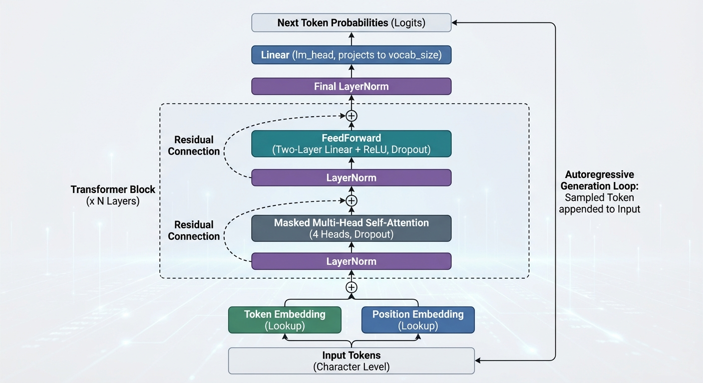

# Decoder-Only Transformer（字符级语言模型）

## 总体功能

本目录实现了一个字符级 **Decoder-Only Transformer**（自回归语言模型）：
- 用 `input.txt` 构建字符级数据集与词表
- 训练模型预测“下一个字符”
- 在训练集/验证集上定期评估 loss
- 训练完成后按概率采样生成文本

## 文件说明

| 文件 | 说明 |
|---|---|
| [`tf_docodeOnly.py`](./tf_docodeOnly.py) | 完整脚本：数据处理、模型定义、训练、评估与文本生成 |
| [`input.txt`](./input.txt) | 训练语料（Tiny Shakespeare） |
| [`dropout.md`](./dropout.md) | Dropout 说明文档 |

## 模型结构

`tf_docodeOnly.py` 中模型 `DecoderOnlyTransformer` 的结构如下：

1. **Token Embedding**：`nn.Embedding(vocab_size, n_embd)`
2. **Position Embedding**：`nn.Embedding(block_size, n_embd)`
3. **N 层 Transformer Block**（`n_layer`）
   - `LayerNorm`
   - Masked Multi-Head Self-Attention（带因果下三角 mask）
   - 残差连接
   - `LayerNorm`
   - FeedForward（两层 MLP，含 dropout）
   - 残差连接
4. **Final LayerNorm**
5. **LM Head**：线性层投影到 `vocab_size`

其中使用的是 **Pre-Norm** 结构：
- `x = x + MultiHeadAttention(LN(x))`
- `x = x + FFN(LN(x))`

## 数据与训练流程

- 从 `input.txt` 读取全文，构建字符级 `stoi/itos` 映射。
- 将数据按 9:1 划分为训练集与验证集。
- `get_batch(split)` 随机采样长度为 `block_size` 的序列：
  - 输入 `x`: `(B, T)`
  - 目标 `y`: `(B, T)`，相当于 `x` 右移一位
- 用 `AdamW` 优化器训练，每隔 `eval_interval` 通过 `estimate_loss()` 评估 train/val 平均 loss。

## 文本生成

- 使用 `model.generate(idx, max_new_tokens)` 进行自回归采样。
- 每一步仅保留最近 `block_size` 个 token 作为上下文。
- 取最后一个位置 logits，`softmax` 后用 `torch.multinomial` 采样下一个 token。

## 数据来源

- Tiny Shakespeare：
  `https://raw.githubusercontent.com/karpathy/char-rnn/master/data/tinyshakespeare/input.txt`

