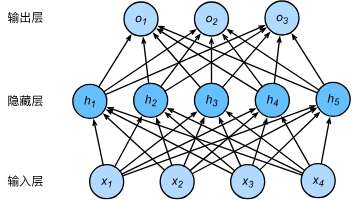
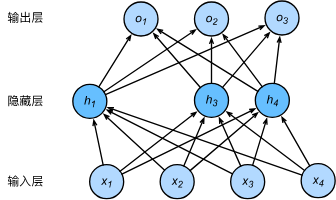

# Dropout：功能与用法说明

`Dropout` 是一种常用的正则化技术，用来降低神经网络过拟合风险。它的核心思想是：

- 在**训练阶段**，随机将一部分神经元输出置为 `0`（“丢弃”）。
- 在**推理阶段**，不再随机丢弃，直接使用完整网络进行预测。

---

## 文件说明

| 文件 | 说明 |
|---|---|
| [`dropout.py`](./dropout.py) | 教学用 Dropout 代码 |

## 1. Dropout 的功能

### 1.1 抑制过拟合

当模型容量较大时，容易在训练集上表现很好、在验证集上变差。`Dropout` 通过随机屏蔽部分特征，减少网络对某些“特定激活路径”的依赖，从而提升泛化能力。

### 1.2 类似“模型集成”的效果

每次训练时，网络都会因为随机丢弃而形成一个不同的“子网络”。这在效果上类似训练了许多共享参数的模型并进行集成。

### 1.3 提升鲁棒性

由于单个神经元不能被长期依赖，模型会学到更分散、更稳健的特征表示。

---

## 2. Dropout 的工作机制

设 dropout 概率为 $p$：

- 每个激活值有 $p$ 的概率被置为 $0$。
- 保留下来的激活在训练时会按 $\frac{1}{1-p}$ 进行缩放（PyTorch 的默认实现为 *inverted dropout*）。

这样做的好处是：

- 训练与推理时的激活期望保持一致；
- 推理阶段无需额外缩放。

---

## 3. PyTorch 中的基本用法

### 3.1 在模块中定义

```python
import torch
import torch.nn as nn

class MLP(nn.Module):
    def __init__(self, in_dim, hidden_dim, out_dim, p=0.2):
        super().__init__()
        self.net = nn.Sequential(
            nn.Linear(in_dim, hidden_dim),
            nn.ReLU(),
            nn.Dropout(p),
            nn.Linear(hidden_dim, out_dim),
        )

    def forward(self, x):
        return self.net(x)
```

### 3.2 训练与推理模式切换

```python
model = MLP(128, 256, 10, p=0.2)

# 训练阶段：Dropout 生效
model.train()

# 推理/验证阶段：Dropout 关闭
model.eval()
```

> 注意：如果忘记在验证或生成前调用 `model.eval()`，结果会因为随机丢弃而不稳定。

---

## 4. 在 Transformer 中的常见位置

在 decoder-only Transformer（如本项目脚本）中，`Dropout` 常用于：

- 注意力权重（`softmax` 后）
- 多头注意力输出投影后
- 前馈网络（FFN/MLP）中

这几处配合使用，可以在不改变主干结构的前提下显著增强正则化效果。

---

## 5. 经验参数与调参建议

- 小模型或数据较少时：`p` 可适当增大（如 `0.2 ~ 0.5`）。
- 大模型或数据充足时：`p` 可适当减小（如 `0.1 ~ 0.2`）。
- 若出现明显欠拟合（训练集 loss 也较高），可尝试减小 `p`。
- 若训练/验证差距大（过拟合），可尝试增大 `p`。

---

## 6. 常见误区

1. **把 dropout 当成“越大越好”**：`p` 过大会破坏信息流，导致训练困难。
2. **验证/生成时没关 dropout**：应在验证和文本生成前调用 `model.eval()`。
3. **所有层都强加高 dropout**：通常优先在 MLP、注意力输出等位置使用，逐步调参。

---

## 7. 与本项目脚本的对应

在 `tf_docodeOnly.py` 中，`dropout = 0.2`，并用于：

- `Head`：对注意力权重做 `Dropout`
- `MultiHeadAttention`：对投影输出做 `Dropout`
- `FeedForward`：对 MLP 输出做 `Dropout`

训练结束后进行生成时，脚本先执行 `model.eval()`，因此生成阶段不会再随机丢弃。

---

## 8. Inverted Dropout

`Inverted Dropout` 是当前主流深度学习框架（如 PyTorch）采用的实现方式。

- 训练阶段：按概率 $p$ 将激活置零；对保留激活乘以 $\frac{1}{1-p}$。
- 推理阶段：不做随机失活，也不需要额外乘以 $(1-p)$。

这样可保证训练与推理时的激活期望一致。

**丢弃法不改变输入的期望**
假设随机变量 $\xi_i$ 取值为 $0$（丢弃）或 $1$（保留），其概率分别为 $p$ 和 $1-p$，则神经元输出可写为：

$$h_i' = \frac{\xi_i}{1 - p} h_i$$

且 $E(\xi_i) = 1 - p$，所以：

$$E(h_i') = \frac{E(\xi_i)}{1 - p} h_i = h_i$$

即，Dropout 在期望意义下不改变激活值尺度。

### 代码实现（PyTorch）

首先，我们的神经网络模型如下：



这是一个 3 层网络：输入层 4 个神经元，中间隐藏层 5 个神经元 $h_i(i = 1, 2, ... , 5)$，输出层 3 个神经元。设激活函数为 $\phi$，输入为 $x_1,...,x_4$，隐藏层参数为 $w_{1i},...,w_{4i}$，偏置为 $b_i$。

隐藏层激活表达式为：

$$h_i = \phi(x_1 w_{1i} + x_2 w_{2i} + x_3 w_{3i} + x_4 w_{4i} + b_i)$$

对隐藏层使用 Dropout，设神经元被“丢弃”的概率为 $p$（保留概率为 $1-p$）。所谓“丢弃”是将该神经元输出置为 $0$，因此该路径不会向后传播。使用 Dropout 后，可能的一种网络形态如下：




### 从零开始实现

为了表达对某一层输入 `X` 应用 Dropout，可以定义如下函数：

```python
def dropout(X, drop_prob):
    X = X.float()
    assert 0 <= drop_prob <= 1  # dropout 概率在 [0, 1]
    keep_prob = 1 - drop_prob   # keep_prob = 1-p
    if keep_prob == 0:          # p=1 时全部丢弃
        return torch.zeros_like(X)
    # 与 X 同形状同设备生成掩码
    mask = (torch.rand_like(X) < keep_prob).float()
    Y = mask * X / keep_prob
    return Y
```

`dropout` 函数核心有两点：

- `mask = (torch.rand_like(X) < keep_prob).float()`
- `Y = mask * X / keep_prob`

1. 使用 `torch.rand_like(X)` 采样均匀随机数，和 `keep_prob` 比较后得到伯努利掩码；乘以 `X` 后实现随机失活。
2. 再除以 `1-p` 是为了保持期望不变，使推理阶段无需额外缩放。