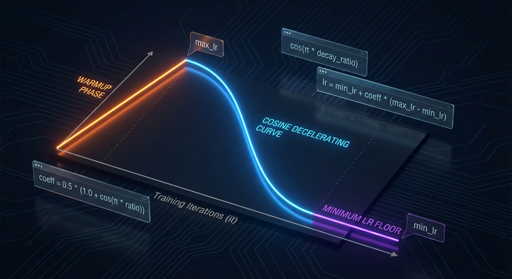
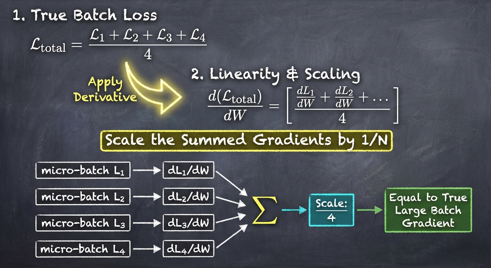
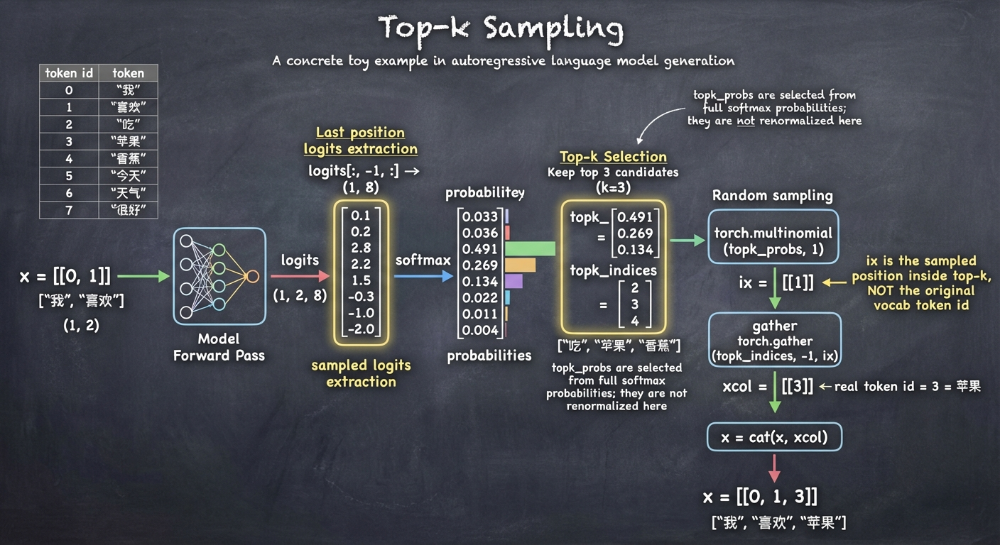

# GPT-2 Single（单文件训练与生成）

## 总体功能

本目录围绕 `train_gpt2_single_demo.py`，演示一个可运行的 GPT-2 风格训练脚本：
- 从零构建模型结构（`CausalSelfAttention`、`MLP`、`Block`、`GPT`）
- 使用 `tiktoken` 将文本编码为 token，并进行批次训练
- 实现完整训练循环：学习率调度、优化器分组、梯度累加、梯度裁剪
- 使用 Top-k 采样进行文本生成

## 文件说明

| 文件 | 说明 |
|---|---|
| [`train_gpt2_single_demo.py`](./train_gpt2_single_demo.py) | 核心脚本：包含模型定义、数据加载、训练循环与生成代码 |
| [`input.txt`](./input.txt) | 训练语料文件，初始化 `DataLoaderLite` 时读取并编码 |

## 功能介绍

### 1) 学习率余弦衰减（`get_lr`）
- **原理**：训练早期先线性 warmup，随后按余弦曲线从 `max_lr` 平滑下降到 `min_lr`，避免学习率突变。
- **功能**：提升训练稳定性；前期加速收敛，后期减小震荡、细化参数更新。
- **实现方法**：
	- warmup 段：`lr = max_lr * (it + 1) / warmup_steps`
	- 衰减段：`coeff = 0.5 * (1 + cos(pi * decay_ratio))`
	- 最终：`lr = min_lr + coeff * (max_lr - min_lr)`

### 2) 优化器参数组与权重衰减（`configure_optimizers`）
- **原理**：不同参数类型应使用不同正则策略。二维及以上参数（如线性层权重、embedding）做衰减；一维参数（bias、LayerNorm）通常不衰减。
- **功能**：通过 L2 风格约束抑制权重过大，降低过拟合风险，同时避免对归一化与偏置参数施加不必要惩罚。
- **实现方法**：
	- 依据 `p.dim()` 分组：`decay_params` 与 `nodecay_params`
	- 构造 `optim_groups`：分别设置 `weight_decay=0.1` 与 `weight_decay=0.0`
	- 使用 `AdamW`，并在 CUDA 场景自动选择 fused 版本（若可用）

### 3) 梯度累加（训练循环中的 `grad_accum_steps`）
- **原理**：梯度对 loss 具有线性可加性。把大 batch 拆成多个 micro-batch，分别 `backward()` 后累加梯度，数学上等价于大 batch 训练。
- **功能**：在显存受限时模拟更大的等效 batch size，提升训练稳定性与统计效率。
- **实现方法**：
	- 设定 `total_batch_size`，由 `grad_accum_steps = total_batch_size // (B * T)` 计算累加步数
	- 每个 micro-step 的 `loss` 先除以 `grad_accum_steps` 再反传，保证梯度尺度与大 batch 一致
	- 累加完成后再统一 `optimizer.step()`

### 4) Top-k 采样（`generate_text`）
- **原理**：在每一步预测中，仅保留概率最高的前 `k` 个候选 token，再按归一化概率随机采样。
- **功能**：在“多样性”和“可控性”之间平衡；避免纯贪心导致重复，也降低从低概率噪声 token 采样的风险。
- **实现方法**：
	- `probs = softmax(logits[:, -1, :])`
	- `topk_probs, topk_indices = torch.topk(probs, 50, dim=-1)`
	- `ix = torch.multinomial(topk_probs, 1)` 并用 `gather` 取回真实 token id

### 5) 梯度等比例缩小（梯度裁剪，`clip_grad_norm_`）
- **原理**：计算全局梯度范数；若超过阈值（这里是 `1.0`），则将所有参数梯度按同一比例缩放到阈值范围内。
- **功能**：抑制梯度爆炸，稳定训练，防止单步更新过大破坏已学习到的参数结构。
- **实现方法**：
	- `norm = torch.nn.utils.clip_grad_norm_(model.parameters(), 1.0)`
	- 当 `norm > 1.0` 时自动执行全局等比例缩放；否则保持不变

### 6) 批次构造（`DataLoaderLite.next_batch()`）
- **原理**：语言模型训练目标是“用当前位置预测下一个 token”。因此输入 `x` 与目标 `y` 是同一序列的错位版本。
- **功能**：高效构造自回归训练样本，保证每个位置都学习 next-token prediction。
- **实现方法**：
	- 从 `self.tokens` 取连续缓冲区 `buf`，长度为 `B*T+1`
	- `x = buf[:-1].view(B, T)`，`y = buf[1:].view(B, T)`
	- 每次将 `current_position` 前移 `B*T`；若越界则回绕到 0

### 7) 其他重点
- **因果自注意力掩码**：`CausalSelfAttention` 使用下三角 mask，确保位置 `t` 只能关注 `<= t` 的历史信息。
- **残差与预归一化结构**：`Block` 采用 `x + attn(LN(x))`、`x + mlp(LN(x))`，改善深层训练稳定性。
- **权重共享**：`lm_head.weight` 与 `wte.weight` 共享，减少参数量并保持输入/输出词嵌入空间一致性。
- **初始化策略**：线性层使用 GPT 风格初始化，残差分支相关投影按层数做缩放，降低深层方差累积风险。
- **设备自适应**：自动检测 `cuda / mps / cpu`，脚本可在不同硬件环境下直接运行。

